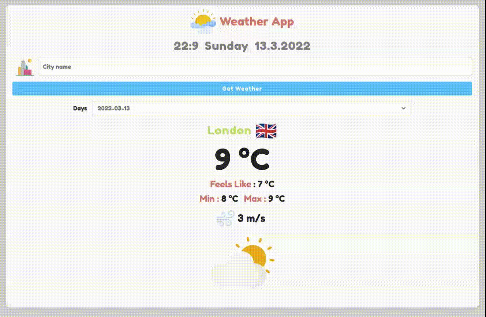

# Weather App in React

## About

The Weather App is a simple React app that fetches weather data from the OpenWeatherMap API.

You can use it to check the weather in your city and in other cities.

## Dependencies
    * Bootstrap v5
    * Axios
    * Lottie

## How Does It Look?

